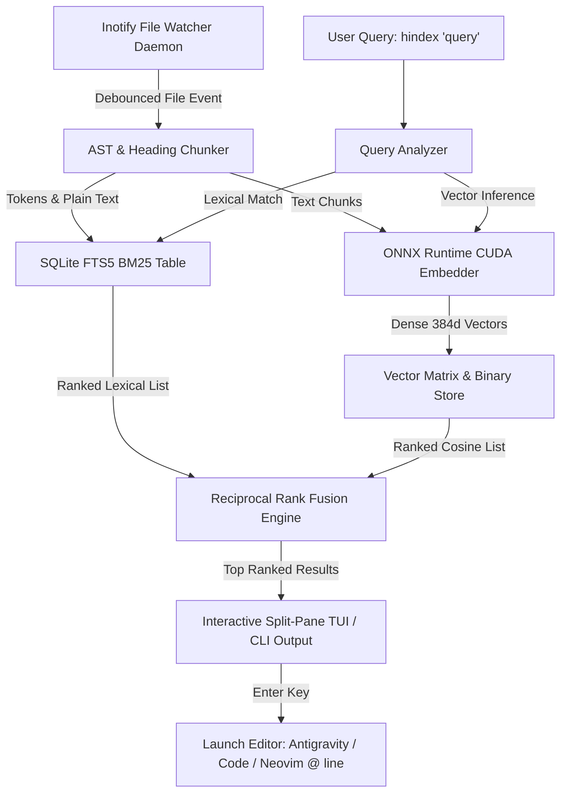

# HyperIndex: High-Performance GPU-Accelerated Local Semantic & Code Search Engine

**Author:** Darnell & Antigravity  
**Date:** 2026-09-10  
**Status:** Approved Specification  
**Target Repository:** `/home/darnell/Projects/hyperindex`

---

## 1. Executive Summary

Modern local file search tools on Linux force an unacceptable compromise:
* `ripgrep` and `grep` are lightning fast, but strictly lexical (cannot understand synonyms, intent, or questions like *"where do we handle session tokens?"*).
* Desktop indexers like GNOME Tracker consume hundreds of megabytes of idle memory, index unwanted system churn, and do not understand code semantics.
* Cloud or heavy local AI tools require gigabytes of PyTorch bloat and high idle resource overhead.

**HyperIndex** is a lightweight, high-throughput developer search engine designed specifically for modern Linux workstations with multi-core CPUs and NVIDIA RTX hardware. It indexes source code repositories, documentation, Markdown notes, and technical PDFs across `~/Projects` using a hybrid architecture:
1. **Lexical Matching:** SQLite FTS5 (BM25) for exact code symbols, variable names, and error codes.
2. **Dense Semantic Matching:** ONNX Runtime CUDA-accelerated embeddings (~80 MB model footprint) for natural language queries and conceptual matches.
3. **Reciprocal Rank Fusion (RRF):** Intelligently fuses lexical and semantic rankings so exact symbol searches hit Rank #1 without drowning out conceptual matches.
4. **Interactive TUI & CLI:** An instant-response split-pane terminal interface with live syntax highlighting and one-keystroke jump to editor at the exact matching line.
5. **Real-Time Incremental Daemon:** Inotify-backed filesystem watcher that debounces edits, respects `.gitignore`, and updates indexes in <100ms.

---

## 2. Hardware & Environment Profile

* **CPU:** 12th Gen Intel Core i7-12700H (14 cores / 20 threads)
* **GPU:** NVIDIA GeForce RTX Laptop GPU (Ampere, CUDA + Tensor Cores)
* **Memory:** 16 GB Physical RAM (with ZRAM enabled, ~8 GB available)
* **OS:** CachyOS Linux (Kernel with BORE scheduler, glibc, Wayland)
* **Storage / Target Directories:** `~/Projects/` (extensible via config)

---

## 3. System Architecture



---

## 4. Detailed Component Design

### 4.1 Ingestion & Chunking Pipeline
* **Target File Types:**
  * Code: `.py`, `.ts`, `.tsx`, `.js`, `.jsx`, `.rs`, `.go`, `.c`, `.cpp`, `.h`, `.sh`, `.json`, `.yaml`, `.toml`, `.sql`, `.html`, `.css`.
  * Documents: `.md`, `.markdown`, `.txt`, `.pdf`, `.rst`.
* **Ignored Patterns:** Automatically respects `.gitignore` in each repository root, plus universal ignore rules:
  * `node_modules/`, `dist/`, `build/`, `.git/`, `__pycache__/`, `target/`, `.venv/`, `*.min.js`, `*.map`, binary assets.
* **Code Chunking Strategy:**
  * Identifies logical blocks (functions, classes, structural headings) to preserve context.
  * Overlapping sliding window (max 512 tokens, 64 token overlap) so cross-line logic is never severed mid-expression.
  * Preserves metadata: relative file path, absolute file path, starting line number, ending line number, enclosing symbol (e.g. `class DatabasePool`), file hash (BLAKE3).

### 4.2 Embedding Engine (ONNX Runtime + CUDA)
* **Model:** `all-MiniLM-L6-v2` or `bge-small-en-v1.5` in quantized ONNX format (384-dimensional dense vectors, ~80 MB file size).
* **Execution Provider:**
  * Primary: `CUDAExecutionProvider` using NVIDIA Tensor Cores. Batched inference (~1000 chunks/sec on RTX GPU).
  * Fallback: `CPUExecutionProvider` configured with all 14 physical/logical CPU cores utilizing AVX2 SIMD instructions.
* **Cold-Start & Memory Management:**
  * Engine loads dynamically during indexing batches and unloads or sleeps during idle, maintaining a sub-100 MB idle resident memory footprint.

### 4.3 Storage & Index Architecture
All persistent data is stored in the standard XDG data directory (`~/.local/share/hyperindex/`):
* **`index.db` (SQLite):**
  * `files` table: `(id INTEGER PRIMARY KEY, path TEXT UNIQUE, hash TEXT, mtime REAL, language TEXT)`
  * `chunks` table: `(id INTEGER PRIMARY KEY, file_id INTEGER, start_line INTEGER, end_line INTEGER, symbol TEXT, content TEXT)`
  * `chunks_fts` virtual table: SQLite FTS5 index on `chunks(content, symbol, path)` with Porter stemming and token prefix indexing.
* **`vectors.bin` / Memory-Mapped Vector Array:**
  * Chunks vectors stored in an efficient memory-mapped dense float32/float16 matrix alongside an index offset lookup table.
  * Cosine similarity computed via vectorized NumPy / BLAS operations in <2ms across 100,000 chunks.

### 4.4 Reciprocal Rank Fusion (RRF)
RRF combines lexical (BM25) and dense semantic (vector) scores without requiring manual weight normalization:
$$\text{RRF\_Score}(d) = \sum_{m \in \{\text{lexical}, \text{semantic}\}} \frac{1}{k + r_m(d)}$$
Where $k = 60$, and $r_m(d)$ is the rank position (1-indexed) of chunk $d$ in system $m$.
* If an exact identifier like `get_auth_token` appears in code, BM25 ranks it #1, giving it an overwhelming boost.
* If a natural language query like *"how does the audio DSP chain process reverb?"* is asked, semantic vector ranks the relevant functions in top positions while BM25 provides supportive keyword reinforcement.

### 4.5 Interactive Terminal TUI & CLI
Built using `rich` / `textual` / `prompt_toolkit`:
* **Left Pane (Results List):**
  * Ranked list of matches showing file name, relative directory path, match line number, relevance percentage, and top matched symbol.
  * Real-time keyboard navigation (`Up` / `Down` or `j` / `k`).
* **Right Pane (Live Preview):**
  * Displays the target file around the match with 15 lines of context above and below.
  * Full syntax highlighting tailored to the file language (Python, TypeScript, Rust, Markdown, etc.).
  * Matching lines visibly highlighted with a distinct background glow.
* **Keybindings:**
  * `Enter`: Open file in default editor (`$EDITOR` or auto-detected Antigravity / VS Code / Neovim) directly focused on the matching line (`code -g file:line` or `nvim +line file`).
  * `c`: Copy file path or snippet to system clipboard via `wl-copy`.
  * `Tab`: Switch focus between search input and results list.
  * `Esc` / `q`: Exit clean.
* **Non-Interactive Scripting Flags:**
  * `hindex "query" --json`: Machine-readable JSON output for agent / piping integration.
  * `hindex "query" --paths-only`: Prints file paths only (drop-in compatibility with `xargs`).
  * `hindex "query" --plain`: Formatted terminal text with line snippets.

### 4.6 File Watcher Daemon
* **Technology:** Python `watchdog` backed by Linux native `inotify`.
* **Debouncing:** 1.5-second cooldown buffer to batch successive writes (e.g. during git checkout, build compilation, or rapid text editing).
* **Efficiency:** Only analyzes modified or new files based on BLAKE3 content hashing; skips re-indexing if file content is unchanged.
* **Systemd User Unit:** Can be run as a lightweight systemd user service (`~/.config/systemd/user/hyperindex.service`).

---

## 5. Directory Structure & Layout

```text
/home/darnell/Projects/hyperindex/
├── hyperindex/
│   ├── __init__.py
│   ├── cli.py                  # Entrypoint CLI argument handling (Typer)
│   ├── config.py               # XDG config parser (~/.config/hyperindex/config.yaml)
│   ├── db.py                   # SQLite FTS5 schema & transaction management
│   ├── embedder.py             # ONNX Runtime CUDA embedding pipeline
│   ├── chunker.py              # AST & text boundary chunking engine
│   ├── search.py               # Reciprocal Rank Fusion (RRF) search orchestrator
│   ├── watcher.py              # Inotify filesystem watcher daemon
│   └── tui/
│       ├── __init__.py
│       ├── app.py              # Textual / Rich split-pane interactive UI
│       └── syntax.py           # Syntax highlighter & preview renderer
├── tests/
│   ├── test_chunker.py
│   ├── test_embedder.py
│   ├── test_search.py
│   └── test_db.py
├── docs/
│   └── superpowers/specs/
│       └── 2026-09-10-hyperindex-design.md
├── pyproject.toml
├── README.md
└── setup.py
```

---

## 6. Verification & Performance Benchmarks

1. **Embedding Throughput:** Benchmark ONNX Runtime CUDA vs CPU on RTX GPU: target > 800 chunks/sec.
2. **Query Latency:** Test hybrid RRF query against 50,000 indexed chunks: target < 5 ms total response time.
3. **Resource Footprint:** Idle memory footprint of watcher daemon: target < 60 MB RSS.
4. **Accuracy Verification:**
   * Exact symbol query: `def get_mem` -> Rank #1 exact match.
   * Semantic intent query: *"how does audio pitch shifting work"* -> Finds DSP / pitch shift code even if exact query words are absent.
5. **Interactive Navigation:** Verifying `Enter` opens the active editor at the exact line number.
